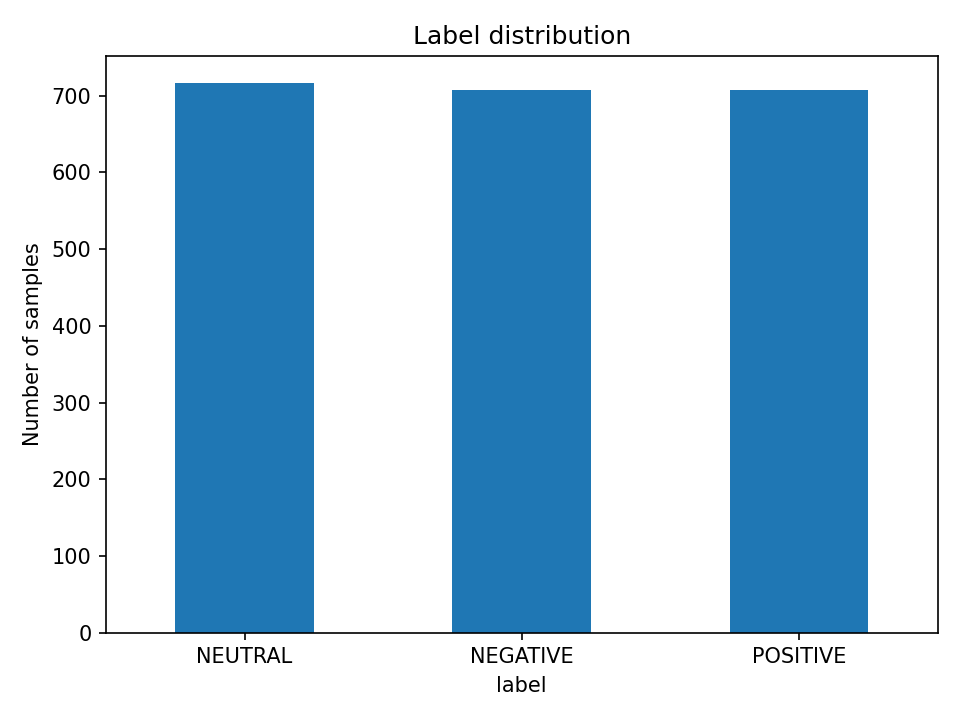
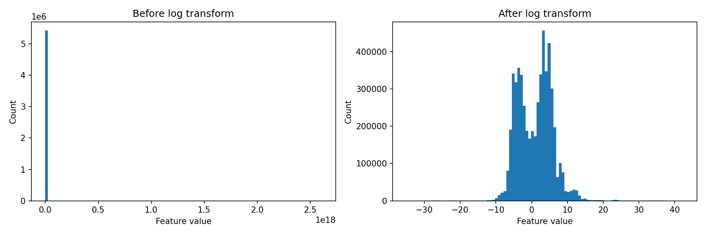
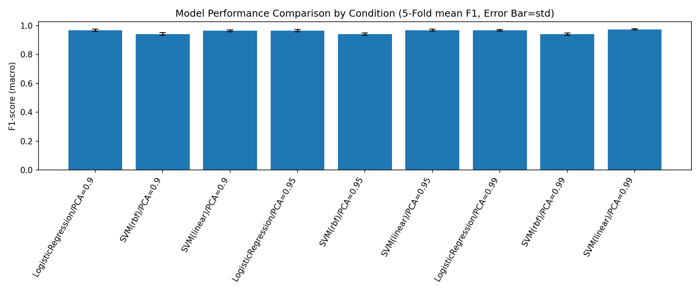

# EEG Emotion-Based Music Recommendation

Classifies emotional state (positive / neutral / negative) from EEG features and recommends songs that match the detected emotion.

**Live demo:** https://eeg-emotion-music.streamlit.app

<!-- TODO: add a short demo GIF here -->
<!--  -->

## Motivation

I first learned about EEG in my Cognitive Science class (COGS 14A), where I saw how widely it is used in research since it is non-invasive, portable, and affordable. I wanted to see what I could build with this kind of data as a student, so I started a project that predicts emotions from EEG data and recommends music that matches the predicted emotion. I originally planned to use the raw DEAP dataset, but since it requires institutional access, I used a public Kaggle dataset instead and practiced raw EEG preprocessing separately. Through this project, I wanted to learn how EEG data is handled and how to turn it into a working program.

## How the app works

```
EEG feature CSV (sample or upload)
  → check that the columns match the training data
  → signed log transform
  → StandardScaler → PCA (99% variance kept) → linear SVM
  → one emotion prediction per row
  → majority vote → one emotion per file
  → songs picked from a manually tagged table
```

The sample files are rows of real EEG features from the dataset, not emotions chosen by the user. The model predicts an emotion for each row, and the bar chart in the app shows the vote.

## Dataset

[EEG Brainwave Dataset: Feeling Emotions](https://www.kaggle.com/datasets/birdy654/eeg-brainwave-dataset-feeling-emotions) (Bird et al., 2019)

- Recorded from 2 people with a 4-channel Muse headband (TP9, AF7, AF8, TP10) while watching emotional film clips
- 2,132 samples × 2,548 pre-extracted statistical features, 3 balanced classes

## Project process

### 1. Raw EEG preprocessing practice

[`notebooks/preprocess.ipynb`](notebooks/preprocess.ipynb)

Before switching to the Kaggle data, I practiced cleaning raw EEG with [MNE-Python](https://mne.tools) on the PhysioNet EEG Motor Movement/Imagery dataset (subject 1, eyes-open baseline).

1. Loaded the recording and cleaned the channel names (e.g., `Fc5.` → `Fc5`)
2. Applied the standard 10-20 electrode layout so components can be shown on a head map
3. Band-pass filtered to 1–40 Hz to remove slow drift (sweat, electrode movement) and high-frequency noise (muscle, power line)
4. Ran ICA with 15 components and removed the eye-blink component, identified by its strong frontal pattern. Blinks overlap with brain rhythms in frequency, so filtering alone cannot remove them
5. Split the clean signal into five frequency bands: delta (1–4 Hz), theta (4–8 Hz), alpha (8–13 Hz), beta (13–30 Hz), gamma (30–40 Hz)

This dataset has no emotion labels, so this step is not part of the final model.

### 2. Exploratory data analysis

[`notebooks/EDA.ipynb`](notebooks/EDA.ipynb)

- No missing values; classes are balanced (~33% each), so accuracy is a fair metric
- Over half of the features (1,500) are FFT-based, and many are redundant. With more features than samples, PCA is a natural fit
- Raw values range up to ~1e18, driven by the `moments` feature group. This caused overflow warnings during training. A signed log transform brings the range to about -35 to 42




### 3. Modeling

[`notebooks/baseline_model.ipynb`](notebooks/baseline_model.ipynb)

**Baseline.** I split the data 80/20 with stratification, then applied the log transform, StandardScaler, and PCA (95% variance, 2,548 → 538 features). On the held-out split, Logistic Regression reached 96.0% accuracy and an RBF SVM reached 93.9%.

**Fair comparison.** A single test split can be lucky, so I switched to stratified 5-fold cross-validation. To keep each fold's test data out of preprocessing, I wrapped the scaler, PCA, and classifier in one scikit-learn `Pipeline`, which is refit inside every fold. I then compared three models across three PCA settings.

| Model | PCA variance kept | Macro F1 (5-fold mean ± std) |
|---|---|---|
| Logistic Regression | 0.99 | 0.968 ± 0.005 |
| SVM (RBF) | 0.99 | 0.940 ± 0.008 |
| **SVM (linear)** | **0.99** | **0.974 ± 0.004** |

The best setting (linear SVM, PCA 0.99) was retrained on the training split and saved as `models/best_model.pkl`.



### 4. Emotion-to-music mapping

[`music_mapper.py`](music_mapper.py) · [`data/track_mapping.csv`](data/track_mapping.csv) · [`notebooks/music_mapper.ipynb`](notebooks/music_mapper.ipynb)

I originally planned to use the Spotify API, but its audio-feature and recommendation endpoints are restricted for new apps. Instead, I hand-picked songs and tagged each one with an emotion label. `recommend_songs()` filters the table by the predicted emotion and randomly picks a few songs. The notebook checks the full chain: load the saved model, predict one test row, and recommend songs for that prediction.

### 5. Web app

[`app.py`](app.py)

The Streamlit app connects everything: it loads the saved model, applies the shared log transform from [`features.py`](features.py), predicts each row, takes a majority vote, and shows matching songs. A refresh button draws a new set of songs for the same emotion.

## Run locally

```bash
git clone https://github.com/Lee-Seungyoon/eeg-emotion-music.git
cd eeg-emotion-music
pip install -r requirements.txt
streamlit run app.py
```

The app runs with the included sample files. To rerun the notebooks, download `emotions.csv` from Kaggle and place it in `data/raw/`.

## Project structure

```
app.py               Streamlit app
features.py          log transform shared by the app and notebooks
music_mapper.py      emotion → song lookup
requirements.txt     pinned package versions
models/              trained pipeline (scaler + PCA + SVM)
data/                sample EEG files and the song mapping table
notebooks/           preprocessing practice, EDA, model experiments, mapping test
images/              figures used in this README
```

## Limitations

- **Only 2 subjects.** High accuracy here does not mean the model generalizes to new people. A subject-independent split was not possible with this data.
- **Optimistic evaluation.** Model selection used cross-validation on the full dataset, including the rows later used as the test split.
- **Sample files come from the same dataset**, so correct predictions in the app demonstrate the pipeline, not real-world performance.
- **Manual song mapping.** The song list is small and hand-tagged, and it was not evaluated with users.
- **Simplified preprocessing.** The practice notebook removes only the eye-blink component; bad-channel interpolation, re-referencing, and other artifact types were not handled.

## Future work

- Test whether removing the extreme-valued `moments` features changes performance
- Hold out a test split before any model selection
- Try a dataset with more subjects and a leave-one-subject-out evaluation
- Connect to a music service API (e.g., Spotify, if access allows) to recommend from a much larger song pool instead of a small hand-tagged list

## Acknowledgments

Dataset: J. J. Bird, A. Ekart, C. D. Buckingham, D. R. Faria, "Mental emotional sentiment classification with an EEG-based brain-machine interface," DISP'19, 2019.
